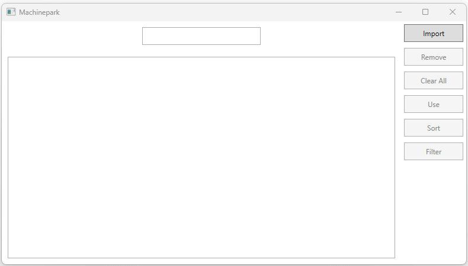

In dit labo ga je een machinepark beheer maken.



## 1. Structuur
Maak 2 folders aan *Data* en *Entities*. De `Store` class plaats je in de *Data* folder, alle andere classes in de *Entities* folder.

## 2. Classes
### Machine
Maak een abstracte class `Machine` aan met volgende public properties:
- string `Name`
- int `LifeSpan`
- float `Price`
- bool `OutOfUse`: returnt true wanneer de LifeSpan <= 0

Daarnaast is er ook een protected abstract readonly property:
- int `LifeSpanCostPerMinute`

De `Machine` class heeft volgende methods:
- void Use(int numberOfMinutes): deze method heeft geen body, maar moet geïmplementeerd worden in de subclasses
- string LifeSpanInfo(): geeft de tekst *OUT OF USE* OF <lifespan: {LifeSpan} h>
- string ToString(): geeft `LifeSpanInfo()` terug

Een `Machine` heeft altijd een naam nodig!

### Router
Maak een class `Router` aan die de abstracte class `Machine` implementeert.
Breidt deze class uit met volgende properties:
- double `WorkSpaceWidth`
- double `WorkSpaceLength`
- double `CostPerMinute`

Verdere info voor een `Router` object:
- de `LifeSpanCostPerMinute` 50 eenheden
- wanneer een `Router` object kan aangemaakt wordt moet een *naam*, *breedte*, *lengte* en *kostprijsperminuut* worden meegegeven
- de LifeSpan van een `Router` is 25000 eenheden
- wijzig de `Use` method zodat de `LifeSpan` wordt verminderd met het aantal minuten maal de `LifeSpanCostPerMinute`
- string ToString() geeft specifieke info van een `Router` object (zie screenshot)

### LaserCutter
Maak een class `LaserCutter` aan die inherit van de `Router` class.
Breidt deze class uit met volgende properties:
- double `Accuracy`

Verdere info voor een `Router` object:
- de `LifeSpanCostPerMinute` 1500 eenheden
- de LifeSpan van een `Router` is 5000 eenheden
- een nieuw object heeft **ook** een accuracy nodig
> [!TIP] 
> Gebruik constructor chaining!
- wijzig de `Use` method zodat de `LifeSpan` wordt verminderd met het aantal minuten maal de `LifeSpanCostPerMinute` PLUS 100 extra "afschrijfkosten"
- string ToString() geeft specifieke info van een `LaserCutter` object (zie screenshot)

### General
Maak een class `General` aan die inherit van de `Machine` class.
- de `LifeSpanCostPerMinute` is 1
- een nieuw object heeft **enkel** een naam nodig
> [!TIP] 
> Gebruik constructor chaining!
- wijzig de `Use` method zodat de `LifeSpan` wordt verminderd met het aantal minuten maal de `LifeSpanCostPerMinute`
- string ToString() geeft specifieke info van een `LaserCutter` object (zie screenshot)

### Store
Gebruik onderstaande code om de Store class aan te maken:
```CS
class Store<T>
{
    private List<T> _data = new List<T>();

    public void AddItem(T item)
    {
        _data.Add(item);
    }

    public IEnumerable<T> GetAllItems()
    {
        return _data;
    }

    public bool RemoveItem(T item)
    {
        return _data.Remove(item);
    }

    public void ClearAllItems()
    {
        _data.Clear();
    }

    public int Count
    {
        get { return _data.Count; }
    }

    public void SortItems(Comparison<T> comparison)
    {
        _data.Sort(comparison);
    }

    public T FindItem(Predicate<T> match)
    {
        return _data.Find(match);
    }

    public bool UpdateItem(T oldItem, T newItem)
    {
        int index = _data.IndexOf(oldItem);
        if (index != -1)
        {
            _data[index] = newItem;
            return true;
        }
        return false;
    }

    public IEnumerable<T> FilterItems(Predicate<T> match)
    {
        return _data.FindAll(match);
    }
}
```

## 3. Import
De *Import* knop vraagt de gebruiker een file te openen (gebruik hiervoor **machines.csv**). Lees deze file uit en maak een nieuwe instance aan van een class, afhankelijk van de eerste kolom:
- "L" => LaserCutter
- "R" => Router
- "G" => General

Voeg dit nieuwe object toe aan de dataStore:
> private Store<Machine> _dataStore = new Store<Machine>();

Tenslotte enable je de knoppen *Clear all*, *Sort* en *Filter*.

## 4. Overige knoppen
### Remove
Gebruik de *RemoveItem()* method om het geselecteerde item uit de listbox te verwijderen.
### Clear all
Gebruik de *ClearAllItems()* method van de datastore om je listbox te clearen.
### Use
In het tekstvak kan het aantal minuten ingegeven worden hoelang een toestel is gebruikt. Geef dit door aan de *Use()* method van het geselecteerde item uit de listbox.
### Sort
Gebruik de *SortItems()* method van de datastore om de items in je listbox te sorteren op **Naam**.
> [!TIP]
> Gebruik hiervoor `string.Compare(x.Name, y.Name)`
### Filter
In het tekstvak kan een (deel van een) naam ingegeven worden. Geeft dit door aan de *FilterItems()* method van de datastore om te filteren op **Naam**.
### UpdateListBox
Maak een method *UpdateListBox()* aan die je in alle knoppen kan gebruiken. Deze zorgt ervoor dat de ListBox wordt gevuld met alle items die in de datastore zitten. Gebruik hiervoor de method *GetAllItems()* van de datastore.
### Out of use
Wanneer een machine OutOfUse gaat mag de *Use* knop niet actief zijn.
> [!TIP]
> Gebruik hiervoor het SelectionChanged event van de ListBox
